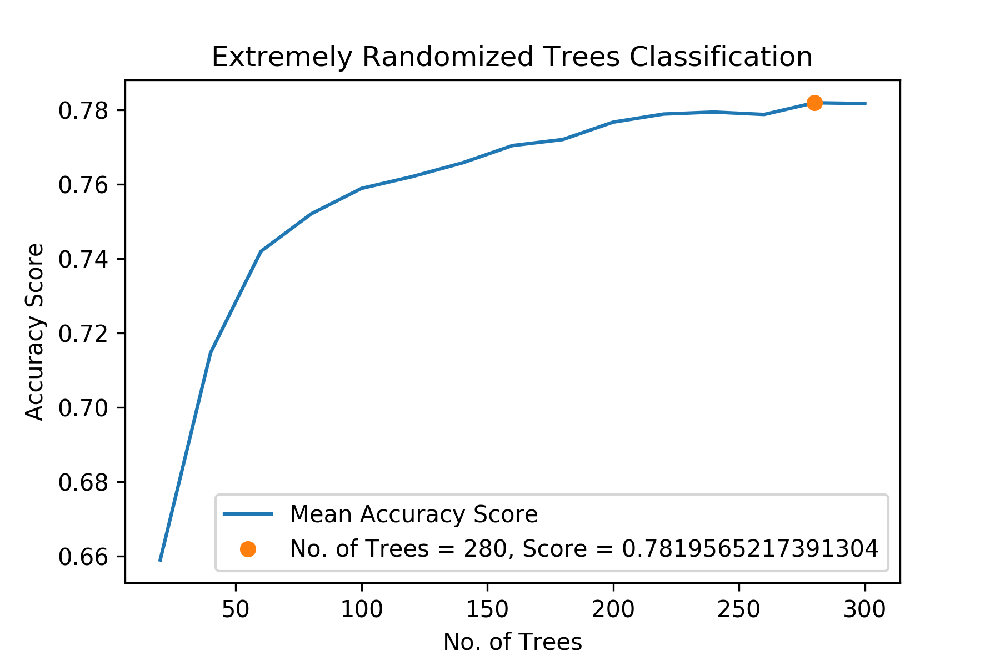
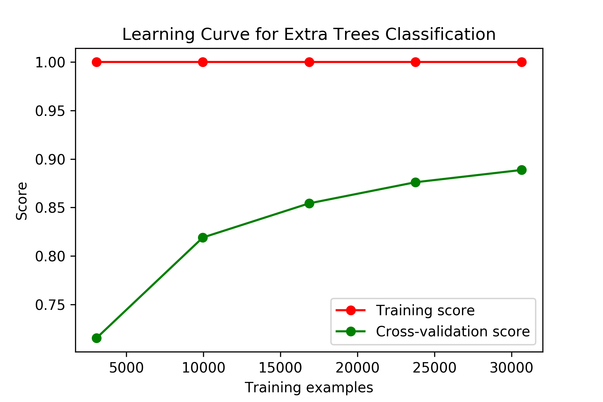

# Devanagari Script Character Recognition Using Machine Learning

## Introduction
This is a Character Recognition System which I developed for Devanagari  
Script. The learning model was trained on 92 thousand images (32x32 pixels)  
of 46 characters, digits 0 to 9 and consonants “ka” to “gya”. The optimal  
result, 92% accuracy, was obtained using Extremely Randomized Decision Forest  
Classification algorithm. The source code is available on Github (under GPLv3  
license), and the dataset is available on Kaggle. [See links below]

-------------------------------------------------------------------------------

## What is Devanagari?
Devanagari is an Indic script and forms a basis for over 100 languages spoken  
in India and Nepal including Hindi, Marathi, Sanskrit, and Maithili. It  
comprises of 47 primary alphabets, 14 vowels, and 33 consonants, and 10  
digits. In addition, the alphabets are modified when a vowel is added to a  
consonant. There is no capitalization of alphabets, unlike Latin languages.

-------------------------------------------------------------------------------

## What is Machine Learning?
Machine learning is a practical approach for Artificial Intelligence. It uses  
concepts of Statistics, Probability, Data Science, Computer Algorithms, and  
Programming. The goal of a machine learning model is to make predictions using  
data. It is one of the most exciting fields in academic and industrial research.

Machine Learning finds various applications in
1. Driverless cars (Google, Tesla)
2. Digital Assistants (OK Google, Siri, Cortana)
3. Recommendation systems (Amazon, Netflix)
4. Spam/Fraud detection (Email, Payment Gateways)
5. Computer vision (OCR, Image Transcription)
6. Various other automation

-------------------------------------------------------------------------------

## What is Character Recognition?
Character Recognition is the identification of printed characters from an  
image, a book, a handwritten note, cheques, or letters. It is similar to using  
a handheld scanner to read a barcode, or reading OMR exam sheets, but it can  
distinguish between different alphabets.

-------------------------------------------------------------------------------

## [Technical] Project Walkthrough
A sample of the dataset was analyzed using various algorithms, and their  
scores and computational costs were compared.

| Algorithm               | Accuracy (in percent)   | Total Time (in seconds) |
| ----------------------- |:-----------------------:| -----------------------:|
| RidgeClassifier         | 42.3384                 | 00.712410               |
| BernoulliNB             | 51.2742                 | 00.168973               |
| GaussianNB              | 39.6972                 | 01.411730               |
| ExtraTreeClassifier     | 31.1093                 | 00.109071               |
| DecisionTreeClassifier  | 36.5119                 | 04.080331               |
| NearestCentroid         | 53.0247                 | 00.127525               |
| KNeighborsClassifier    | 72.1442                 | 36.413726               |
| ExtraTreesClassifier    | 57.4804                 | 00.563712               |
| RandomForestClassifier  | 54.3047                 | 00.932044               |

-------------------------------------------------------------------------------

K Nearest Neighbors Classification, Extremely Randomized Decision Forest  
Classification and Random Forest Classification algorithm were selected and a  
Grid Search was done to obtain optimum parameters and scores of these  
algorithms and compare their performance.

-------------------------------------------------------------------------------

Learning Curve for Extra Trees Classification algorithm was plotted.

-------------------------------------------------------------------------------

## Conclusions
The final result, using Extremely Randomized Decision Forest Classification  
Algorithm with 256 trees gave an accuracy score of 92%.

-------------------------------------------------------------------------------

## What's next!
I intend to expand the study by creating or obtaining, the complete dataset,  
vowels are missing right now. The complete model will then be used to create  
an application which can read any language in Devanagari script from a book or  
a handwritten note.

-------------------------------------------------------------------------------

## References
The dataset was originally created by Computer Vision Research Group, Nepal.  
In a similar study, a student from Kathmandu, Subhigya Nepal used Neural   
Network on the digits classes, 0 to 9, obtaining an accuracy of 95%   
(unverified).

-------------------------------------------------------------------------------

## Getting Involved
The code, as well as the dataset, is available freely, under GNU GPLv3, and  
all further development will remain free. You may use the dataset to build  
your own models or use the existing models to improve it, on the condition  
that you also keep it free (GPLv3 clause).

-------------------------------------------------------------------------------

## External Links
- [Github Source Repository](https://github.com/rishianand9/devanagari-character-recognition)
- [Kaggle Database Repository](https://www.kaggle.com/rishianand/devanagari-character-set)
- [Computer Vision Research Group - Website archive](https://web.archive.org/web/20160105230017/http://cvresearchnepal.com/wordpress/dhcd/)
- [Subhigya Nepal - blog](http://www.thelacunablog.com/)

-------------------------------------------------------------------------------

## Contact
    Email ID - rishianand54@gmail.com
